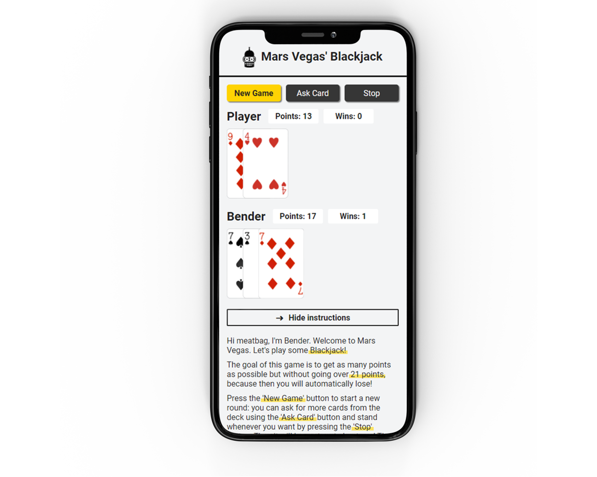

# Blackjack

El objetivo es desarrollar un juego de cartas llamado **Blackjack**, también conocido como *veintinuo*, donde el usuario puede competir contra el ordenador. El juego consiste en sumar mediante cartas un valor lo más cercano posible a 21 pero sin pasarse.

El proyecto forma parte de un curso de Udemy de Fernando Herrera sobre JavaScript ES6. Por tanto el código base es de su autoría, pero he introducido modificaciones propias, mejoras y refactorización del código: mayor semántica y accesibilidad a través de HTML5, uso de SASS y partials para trabajar de manera más ordenada y automatización de tareas mediante Gulp. Además, he modificado complementamente el **diseño UI/UX** responsive partiendo de una idea propia y he añadidido nuevas **funcionalidades** como:

- Botón de instrucciones.
- Juego de 5 rondas con contador de victorias.
- Modal para anunciar el ganador final.

Mi intención es seguir añadiendo mejoras y más funcionalidades nuevas, de modo que puedes consultar la sección de Projects para ver cuáles son o sobre cuáles estoy trabajando. Cualquier feedback es bienvenido.

### Tecnologías usadas:

- HTML5 y SASS
- JavaScript ES6
- Gulp y Git

### Resultado final:




### Pasos para arrancar el proyecto:

> **NOTA:** Necesitas tener instalado [Node JS](https://nodejs.org/) para ejecutar el proyecto:

1. Instala las dependencias locales ejecutando en la terminal el comando:

```bash
npm install
```

2. Una vez hemos instalado las dependencias, ya podemos arrancar el proyecto. Para ello ejecuta el comando:

```bash
npm start
```

---

Muchas gracias por leer hasta aquí. Glhf! 😄

<!--
### Estructura de carpetas

La estructura de carpetas sigue este esquema:

```
src
 ├─ api // los ficheros de esta carpeta se copian en public/api/
 |  └─ data.json
 ├─ images
 |  └─ logo.jpg
 ├─ js // los ficheros de esta carpeta se concatenan en el fichero main.js y este se guarda en public/main.js
 |  ├─ main.js
 |  └─ events.js
 ├─ scss
 |  ├─ components
 |  ├─ core
 |  ├─ layout
 |  └─ pages
 └─ html
    └─ partials
```

-->
